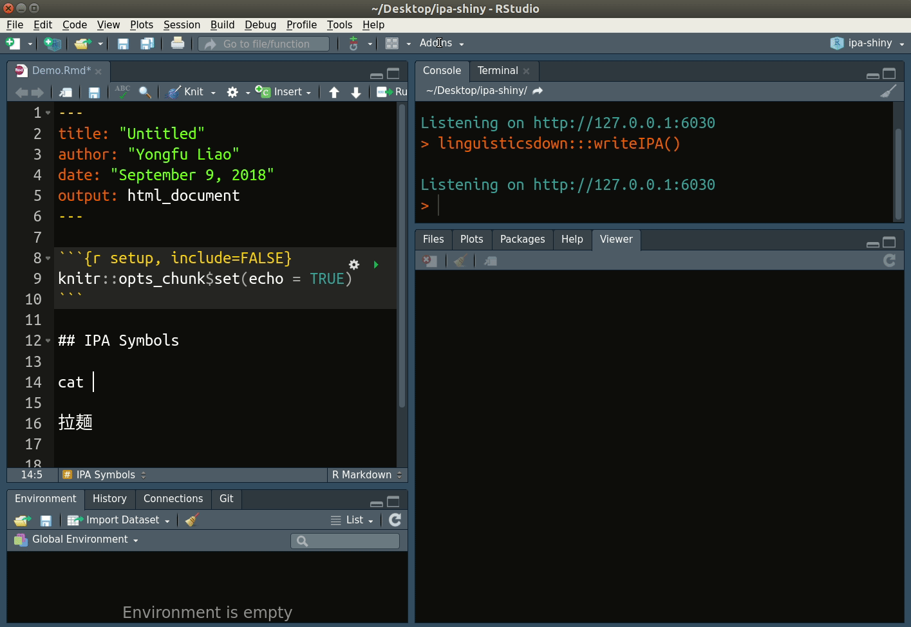
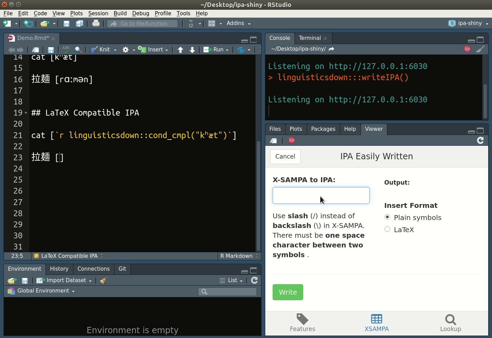

<!-- README.md is generated from README.Rmd. Please edit that file -->
[](https://travis-ci.org/liao961120/linguisticsdown) [](https://cran.r-project.org/)

linguisticsdown
===============

The goal of **linguisticsdown** is to support Linguistics-related doucument writing in R Markdown, such as providing a [Shiny Gadget](https://shiny.rstudio.com/articles/gadgets.html) to write and insert IPA symbols easily and functions to draw syntax tree (not implemented yet).

Installation
------------

``` r
devtools::install_github("liao961120/linguisticsdown")
```

Usage
-----

### Write IPA symbols by Phonetic Features



### Write IPA symbols with [X-SAMPA](https://en.wikipedia.org/wiki/X-SAMPA)


### Shiny Live Demo

Visit [this site](https://liao961120.shinyapps.io/IPA-Easily-Written/) to use the Shiny Gadget interactively.

Conditional Compilation
-----------------------

IPA symbols may not be properly rendered when output to PDF, depending on the font chosen to compile LaTeX to PDF. See [wikipedia](https://en.wikipedia.org/wiki/International_Phonetic_Alphabet#Typefaces) for a list of fonts supporting IPA symbols.

To overcome this problem, you can use a document template provided by **linguisticsdown** by calling:

``` r
rmarkdown::draft("name_your_file.Rmd",
                 template = "support_ipa",
                 package = "linguisticsdown")
```

, or if you use [RStudio](https://www.rstudio.com/):


Then, make sure **"LaTeX" in "Insert Format" is selected** when inserting IPA symbols:



This option wraps the IPA symbols with the function `cond_cmpl()`, which wraps latex code around IPA symbols when compiled to LaTeX but leaves the symbols untouched when compiled to HTML formats. Hence, you can compiled to any format with properly rendered IPA symbols without changing the source file.

Note: make sure you have the font, [**Doulos SIL**](https://software.sil.org/doulos/download/), installed on your computer to make conditional compilation work. If you would like to use other fonts, read the document template `support_ipa` for more details.

To Do
-----

1.  Draw Syntax Tree

<style>
img.big {
border-radius: 10px;
box-shadow: 2px 4px 6px rgba(0, 0, 0, .5);
margin-bottom: 1em;
width: 60%
}
</style>
